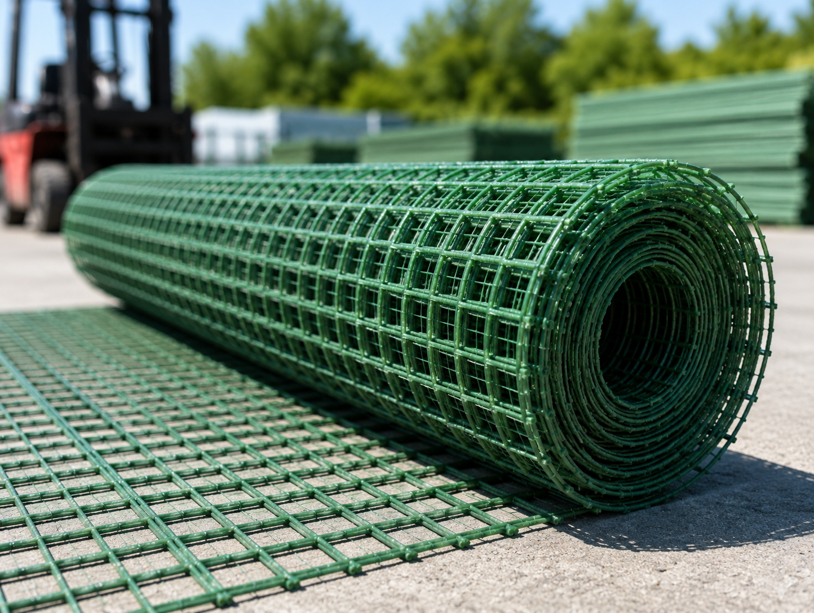

🌿 COMPOSITE — сайт виробника композитної сітки та арматури

Односторінковий лендинг + прайс-сторінка для бренду Composite By Pernerovski (м. Івано-Франківськ): композитна будівельна сітка та композитна арматура. Сайт зроблений під рекламний трафік (Meta Ads) — головна мета сторінки — заявка від клієнта.

🔗 Демо: https://rosticmel-07.github.io/KompoSite/

  
 
    

✨ Можливості
Головна сторінка — переваги продукту, застосування (садівництво / будівництво), галерея, відгуки клієнтів, опис матеріалу.
Прайс — тизер із стартовими цінами на головній та окрема сторінка /prices.html з повними таблицями (арматура + сітка, перемикання вкладками, діп-лінки на конкретну вкладку).
Форма заявки з валідацією на льоту (ім'я, телефон з маскою, e-mail), відправка на Mock API та подія Lead у Meta Pixel після успішної відправки.
Meta Pixel (PageView + Lead) підключений на кожній сторінці — сайт розрахований на трафік із Facebook/Instagram Ads.
Адаптивна верстка mobile-first (320 → 768 → 1440), плавний скрол по секціях, reveal-анімації при скролі, мобільне меню.
🛠 Технології
Vite — збірка та дев-сервер (vanilla JS, без фреймворку)
vite-plugin-html-inject — збірка сторінок з HTML-партіалів (<load src="..." />)
vite-plugin-full-reload — автоперезавантаження при зміні партіалів
PostCSS + postcss-sort-media-queries
Чистий CSS зі змінними (base.css) — без препроцесорів і UI-бібліотек
gh-pages + GitHub Actions — автодеплой
📁 Структура проєкту
src/
├── index.html            # головна сторінка
├── prices.html           # сторінка «Прайс»
├── main.js                # вся інтерактивність (меню, форма, вкладки прайсу…)
├── base.css                # змінні, скидання стилів, утиліти
├── css/                     # стилі окремих секцій
├── partials/                # HTML-блоки, що інжектяться в сторінки
│   ├── header.html / header-prices.html
│   ├── footer.html / footer-prices.html
│   ├── hero.html, usecases.html, advantages.html
│   ├── prices-teaser.html, prices-hero.html, prices-tables.html
│   ├── gallery.html, about.html, reviews.html, contact.html
└── img/                     # зображення (оптимізуються тільки при білді)
🚀 Швидкий старт

Потрібен Node.js LTS.

bash
git clone https://github.com/rosticmel-07/KompoSite.git
cd KompoSite
npm install
npm run dev

Дев-сервер підніметься на http://localhost:5173 і сам перезавантажиться при зміні файлів у src/.

Інші команди:

bash
npm run build     # продакшн-збірка у dist/
npm run preview   # локальний перегляд зібраної версії
📦 Деплой

Автоматичний, через .github/workflows/deploy.yml: кожен пуш у main запускає збірку (npm run build) і публікує вміст dist/ у гілку gh-pages, звідки GitHub Pages роздає сайт за адресою вище. Прапор --base=/KompoSite/ у скрипті build (package.json) вже налаштований під назву цього репозиторію — міняти нічого не треба.

📊 Заявки та аналітика

Форма (#contact) шле POST-запит на Mock API (mockapi.io) і одразу після успіху відправляє подію Lead у Meta Pixel — саме ці ліди рахуються в рекламному кабінеті Meta Ads.

🙋 Автор

@rosticmel-07
